<!-- @import "[TOC]" {cmd="toc" depthFrom=1 depthTo=6 orderedList=false} -->

<!-- code_chunk_output -->

- [1. 基于微信小程序的招聘资讯发布平台的设计与实现](#1-基于微信小程序的招聘资讯发布平台的设计与实现)
      - [1.1. 微信：weinixieshi210](#11-微信weinixieshi210)
      - [1.2. 系统描述](#12-系统描述)
      - [1.3. 系统功能结构图](#13-系统功能结构图)
      - [1.4. 系统实现效果](#14-系统实现效果)
      - [1.5. 系统前台效果](#15-系统前台效果)
        - [1.5.1. 用户登录与注册](#151-用户登录与注册)
        - [1.5.2. 招聘资讯模块](#152-招聘资讯模块)
        - [1.5.3. 薪资爆料模块](#153-薪资爆料模块)
        - [1.5.4. 个人信息管理](#154-个人信息管理)
      - [1.6. 系统后台效果](#16-系统后台效果)
        - [1.6.1. HR评论管理模块](#161-hr评论管理模块)
        - [1.6.2. 招聘资讯录入、编辑模块](#162-招聘资讯录入-编辑模块)
        - [1.6.3. 报表功能](#163-报表功能)
        - [1.6.4. 头条管理功能](#164-头条管理功能)
        - [1.6.5. 招聘资讯管理功能](#165-招聘资讯管理功能)
        - [1.6.6. 薪资爆料管理功能](#166-薪资爆料管理功能)
        - [1.6.7. 评论管理功能](#167-评论管理功能)
        - [1.6.8. 意见反馈管理功能](#168-意见反馈管理功能)
        - [1.6.9. 企业信息管理](#169-企业信息管理)
        - [1.6.10. HR信息管理](#1610-hr信息管理)
        - [1.6.11. 会员信息管理](#1611-会员信息管理)
        - [1.6.12. 管理员信息管理](#1612-管理员信息管理)
      - [1.7. 如何运行](#17-如何运行)
      - [1.8. 微信：weinixieshi210](#18-微信weinixieshi210)
      - [1.9. 小程序后端](#19-小程序后端)

<!-- /code_chunk_output -->

# 1. 基于微信小程序的招聘资讯发布平台的设计与实现
  [](https://github.com/DavidWhom/recruit)
[](https://github.com/DavidWhom/recruit/fork)

#### 1.1. 微信：weinixieshi210
<p align="center">
    
</p>

#### 1.2. 系统描述

* 项目前端基于微信小程序，使用技术：mpvue、Vant、AntV
* 后端基于Spring Boot、myBatis、Redis, DB使用mysql

#### 1.3. 系统功能结构图

<p align="center">
    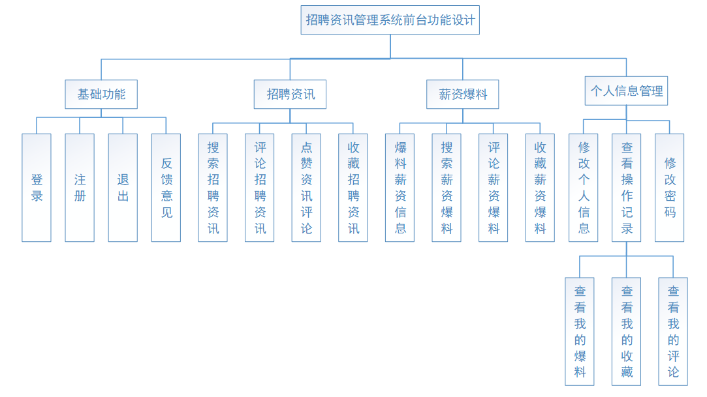
    <br/>
    <span>前台系统功能结构图</span>
</p>

<p align="center">
    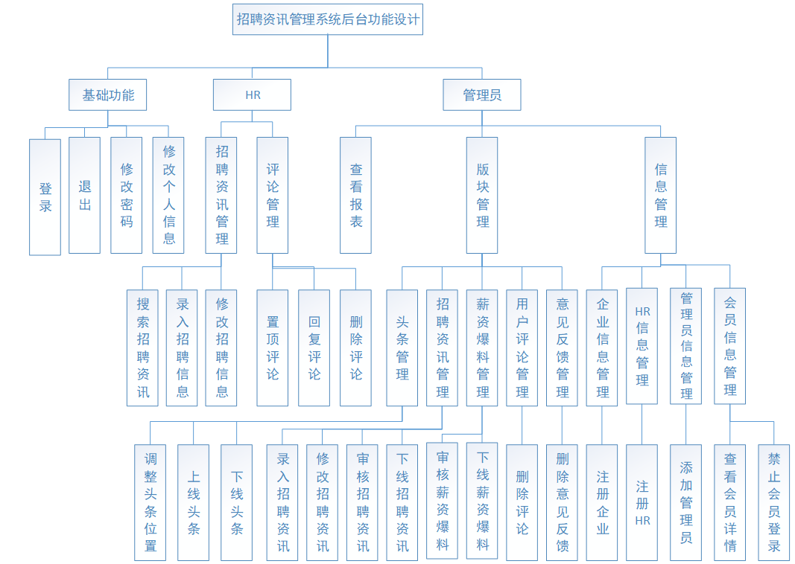
    <br/>
    <span>后台系统功能结构图</span>
</p>

#### 1.4. 系统实现效果
#### 1.5. 系统前台效果
##### 1.5.1. 用户登录与注册
该模块用于会员的注册，如果是未注册会员访问本系统，即游客身份，那么游客具有的功能只是查看招聘资讯、查看薪资爆料概要以及搜索招聘资讯和薪资爆料功能。只有通过注册成为系统会员才能使用更多的功能，例如评论互动、查看爆料详情、爆料薪资等。注册需要提供的信息为用户名、密码、手机号（选填）。用户注册信息满足用户名长度和唯一性校验、密码难度校验、手机号格式校验后方可注册成功。其中用户名唯一性校验跟数据库交互，密码难度和手机号校验使用正则表达式。会员注册界面如图5-1所示。

<p align="center">
    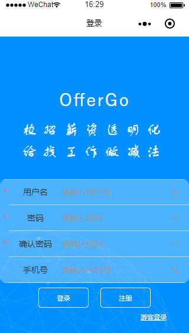
    <br/>
    <span>图5-1 会员注册界面</span>
</p>

登录模块可用于会员、HR、管理员登录。只有通过登录会员、HR、管理员才能使用相应的功能。登录界面如图5-2所示。

<p align="center">
    
    <br/>
    <span>图5-2 登录界面</span>
</p>

<p align="center">
    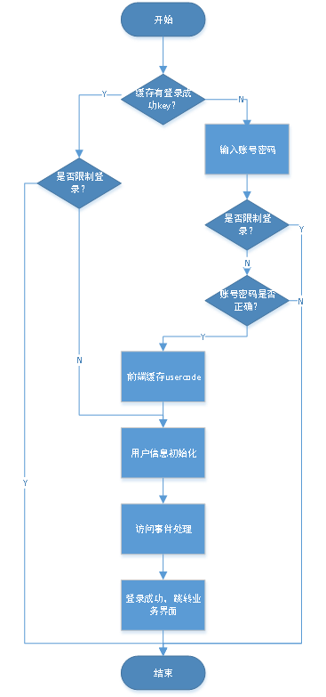
    <br/>
    <span>图5-3 登录流程图</span>
</p>

##### 1.5.2. 招聘资讯模块
会员登录本系统后可以正常使用招聘资讯模块的功能，搜索招聘资讯、查看资讯详情、评论资讯、点赞评论、收藏招聘资讯等。系统首页如图5-4所示，首页显示的是头条招聘资讯，用户可以浏览招聘信息、面试经验分享、技术知识分享等内容。

<p align="center">
    
    <br/>
    <span>图5-4 系统首页</span>
</p>
会员搜索框关键字搜索公司名、城市、岗位名可以搜索到符合条件的招聘信息，在结果中除了招聘信息不会有管理员录入的资讯内容，使用了相关数据库字段来筛选招聘信息表中的内容。搜索结果页面如图5-5所示。
<p align="center">
    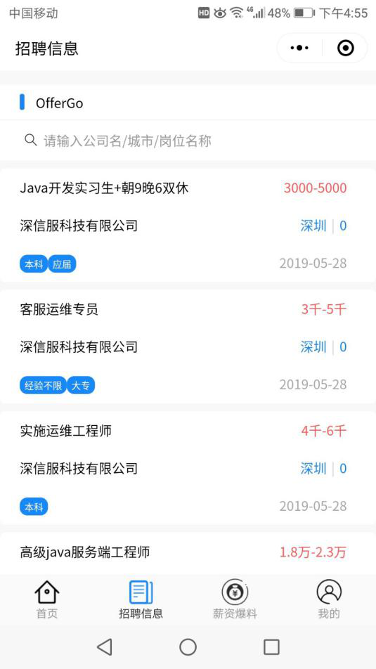
    <br/>
    <span>图5-5 招聘资讯搜索结果页</span>
</p>

面试经验分享、技术知识等并不会在招聘信息搜索中被搜索出来，这些内容只为头条版块服务。点击进入招聘资讯可以查看招聘资讯详情并参与讨论互动。资讯详情页面如图5-6所示，会员可在资讯详情页面进行阅读资讯、评论互动、收藏操作。由于后端资讯详情的内容是以markdown文本的格式存储的，因此需要解析。这边采用在小程序端解析Markdown语法的策略，使用的是开源插件mpvue-wxParse来将Markdown转化为Wxml。
<p align="center">
       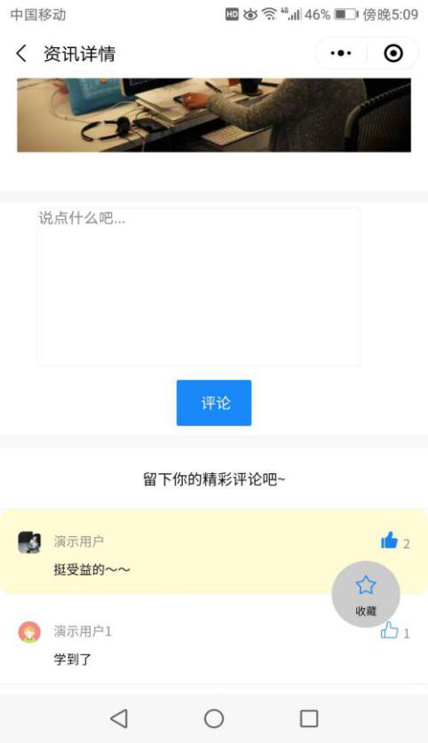
    <br/>
    <span>图5-6 招聘资讯详情页面</span>
</p>

用户在浏览资讯时会有增加资讯浏览量的逻辑操作，同一个用户30分钟内浏览资讯只增加一次浏览量的功能也是通过Redis完成。代码层面Redis实现浏览量过滤的步骤：
（1）构造用户查看当前文章的唯一key（key由常量字符串、用户ID、资讯ID组成）。
（2）使用Redis的isKeySurvival接口校验key是否存在。
（3）存在则不做增加浏览量逻辑，不存在则使用Redis的setkeyEx接口缓存key然后再做增加浏览量的逻辑。
##### 1.5.3. 薪资爆料模块
薪资爆料模块主要的功能包含新增爆料功能、搜索薪资爆料、查看爆料详情、收藏爆料、评论爆料等。会员新增薪资爆料的界面如图5-8所示。新增爆料不仅会员可以新增，管理员、HR也可以新增。薪资爆料从发布到审核的流程图如图5-9所示。
<p align="center">
    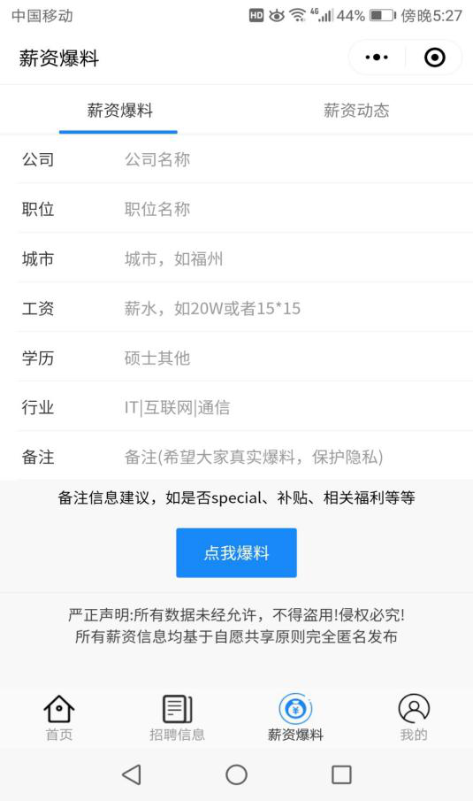
    <br/>
    <span>图5-8 新增薪资爆料界面</span>
</p>

<p align="center">
    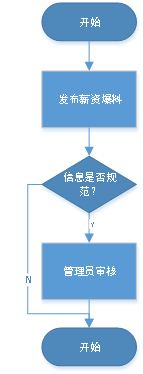
    <br/>
    <span>图5-9 薪资爆料发布审核流程图</span>
</p>

用户可在薪资爆料搜索页面关键搜索感兴趣的爆料信息，支持按公司名、城市和岗位名称的方式搜索。薪资爆料搜索页面如图5-10所示。
<p align="center">
    
    <br/>
    <span>图5-10 薪资爆料搜索页面</span>
</p>

点击薪资爆料概要进入薪资爆料详情即可进行评论互动、收藏爆料、爆料可行度评价等操作。薪资爆料详情如图5-11所示。为了保密爆料者信息，爆料详情不会展示爆料人相关信息，评论者的个人信息也不会给与展示。用户查看爆料信息，也会有增加爆料浏览量的逻辑，系统默认同一用户30分钟访问增加一次浏览量。同样地还是用Redis缓存来实现。用户查看薪资爆料的流程图如图5-12所示。

<p align="center">
    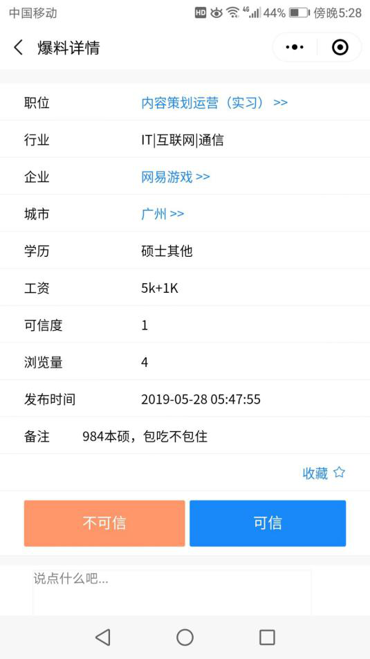   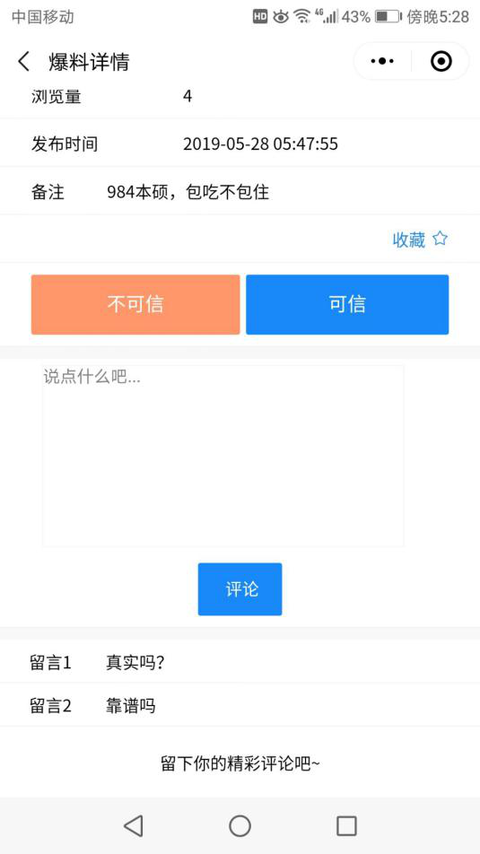
    <br/>
    <span>图5-11 薪资爆料详情界面</span>
</p>

<p align="center">
    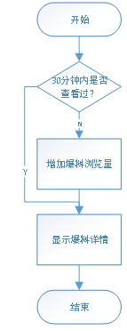
    <br/>
    <span>图5-12 查看薪资爆料详情流程图</span>
</p>

##### 1.5.4. 个人信息管理
个人信息管理包含修改用户个人信息、修改密码、查看我的收藏、查看我的评论、查看我的爆料、反馈意见和退出功能。个人信息管理页面如图5-13所示。其中我的收藏、我的爆料、我的评论三个信息的展示均以弹出层的形式展示，例如会员查看“我的收藏”如图5-14所示。
<p align="center">
    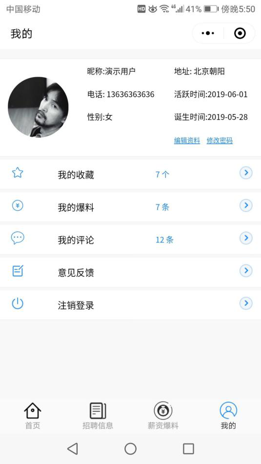   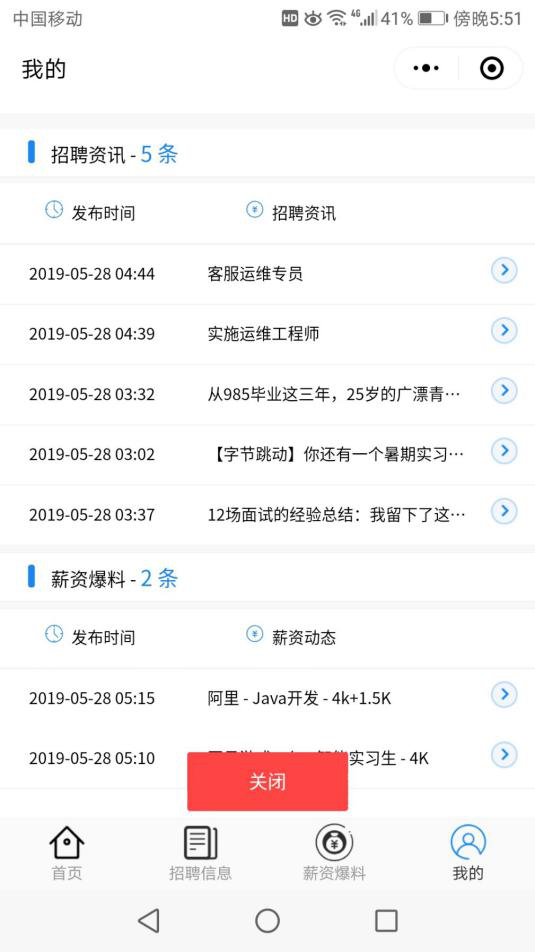
    <br/>
    <span>图5-13 个人信息管理界面</span>
    <span>图5-14 会员查看“我的收藏”界面</span>
</p>

#### 1.6. 系统后台效果
系统后台管理分为HR后台管理和管理员后台管理，系统后台管理又分为小程序端和Web端，但是后台管理的功能主要在微信小程序端，Web端主要为招聘资讯录入和修改服务。
##### 1.6.1. HR评论管理模块
HR发布的招聘资讯下的评论由HR来管理，可进行置顶、删除、回复等操作。HR可在其后台管理页面查看其发布的招聘资讯。HR后台管理页面如图5-15所示。评论管理操作需要进入到招聘信息详情页面才能操作评论。评论管理页面如图5-16所示。

<p align="center">
    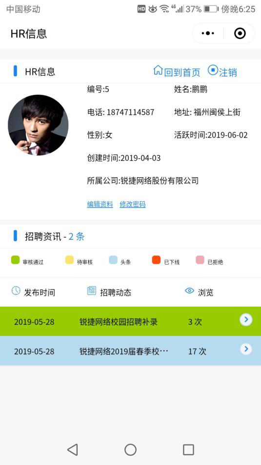
    <br/>
    <span>图5-15  HR后台管理界面</span>
</p>

<p align="center">
    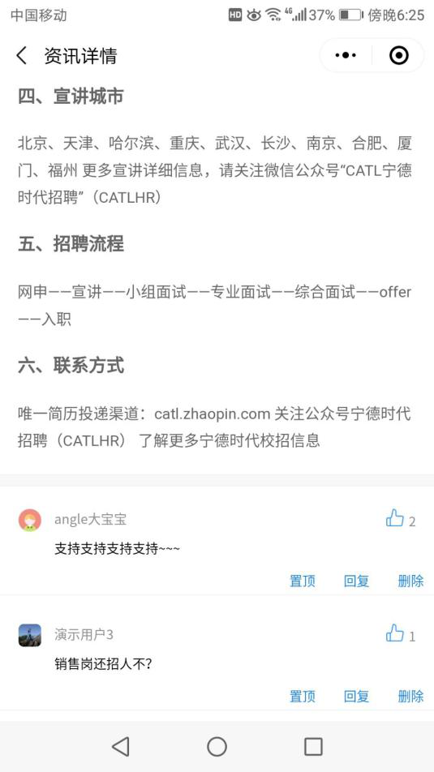
    <br/>
    <span>图5-16  评论管理界面</span>
</p>

##### 1.6.2. 招聘资讯录入、编辑模块
该模块运行在Web端，仅提供给HR和管理员用。录入招聘资讯支持Markdown语法的方式编辑招聘资讯，录入招聘资讯界面如图5-17所示。Markdown输入使用开源的Markdown编辑器editormd来实现，只需在前端以js的形式引入并按照文档进行配置即可完成。同时可在Web查看招聘资讯概要掌控已发布资讯的状态。

<p align="center">
    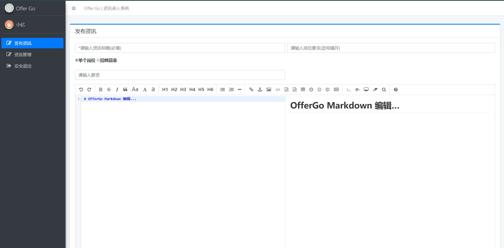
    <br/>
    <span>图5-17 录入招聘资讯界面</span>
</p>

<p align="center">
    
    <br/>
    <span>图5-18 查看招聘资讯概要</span>
</p>

##### 1.6.3. 报表功能
报表功能供管理员使用，用于统计招聘发布数、用户流量、薪资爆料发布数、用户评论发布数、意见反馈数。支持日报、周报、月报的方式查看。管理员查看报表功能界面如图5-19所示。

<p align="center">
    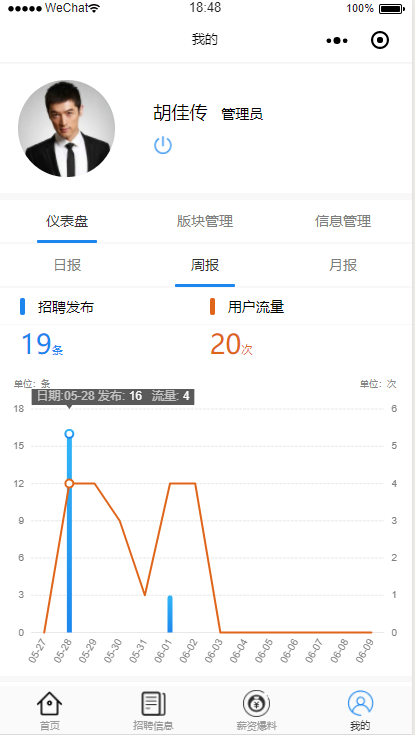
</p>

<p align="center">
    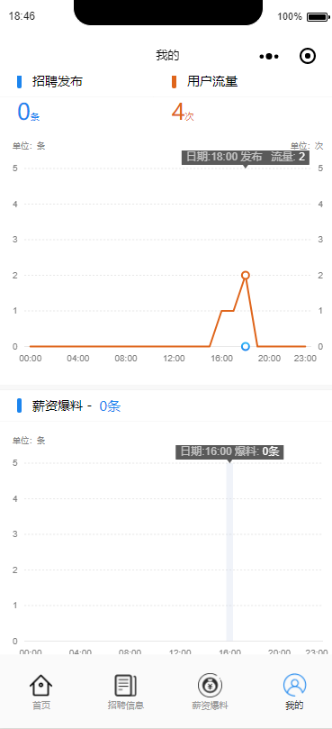
</p>

<p align="center">
    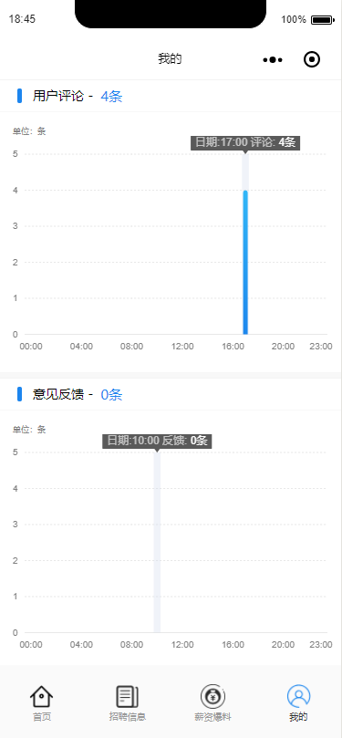
    <br/>
    <span>图5-19 报表界面</span>
</p>

##### 1.6.4. 头条管理功能
头条管理功能主要包括查看头条、切换头条位置、上线头条、下线头条等功能。头条管理界面如图5-20所示。管理员可在头条区域切换头条的位置，实时修改首页的头条显示顺序。通过在对应资讯栏目向左滑动进行头条上下线操作。

<p align="center">
    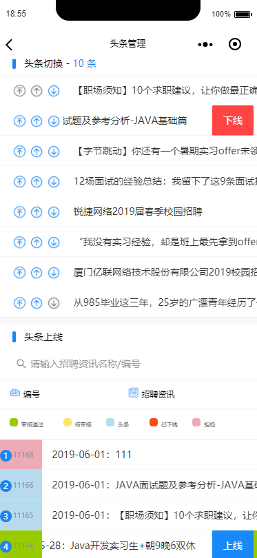
    <br/>
    <span>图5-20 头条管理界面</span>
</p>

##### 1.6.5. 招聘资讯管理功能
在招聘资讯管理界面可进行招聘资讯审核、上线资讯、下线资讯等操作。招聘资讯管理界面如图5-21所示。同理触碰资讯所在行向左或向右滑动可控制资讯上线下线操作。

<p align="center">
    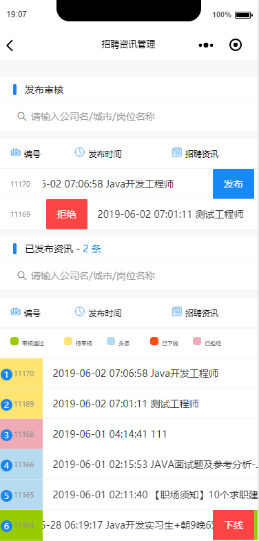
    <br/>
    <span>图5-21 招聘资讯管理界面</span>
</p>

##### 1.6.6. 薪资爆料管理功能
在薪资爆料管理界面可进行薪资爆料审核、上线爆料、下线爆料等操作。薪资爆料管理界面如图5-22所示。同理触碰爆料所在行向左或向右滑动可控制爆料的上线和下线操作。

<p align="center">
    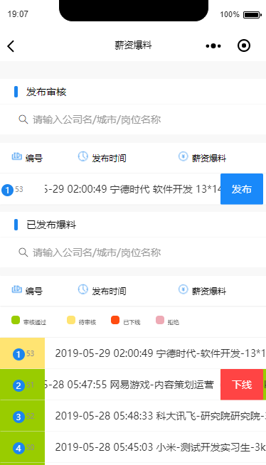
    <br/>
    <span>图5-22 薪资爆料管理界面</span>
</p>

##### 1.6.7. 评论管理功能
评论管理功能主要是搜索查看评论信息以及删除评论信息。选中对应评论向左滑动可进行评论的删除操作。点击选中对应的评论会弹出评论的详细信息。评论管理界面如图5-23所示。

<p align="center">
    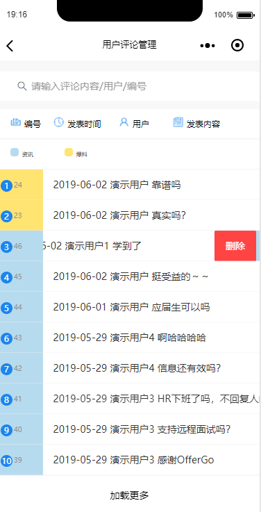   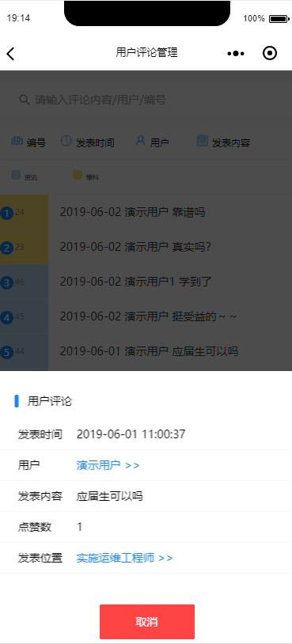
    <br/>
    <span>图5-23 评论管理界面</span>
</p>

##### 1.6.8. 意见反馈管理功能
意见反馈管理功能主要是搜索查看意见反馈信息以及删除反馈信息。选中对应意见反馈向左滑动可进行意见反馈的删除操作。点击选中对应的反馈会弹出反馈的详细信息。意见反馈管理界面如图5-24所示。

<p align="center">
    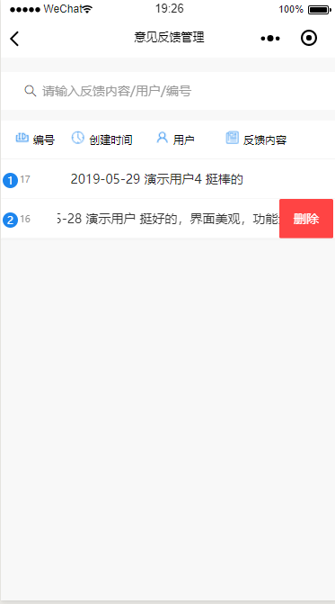   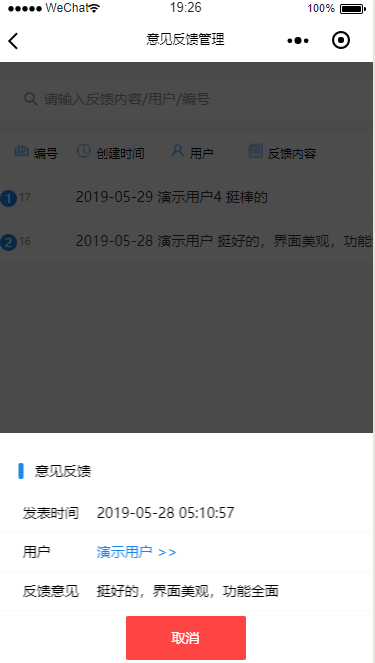
    <br/>
    <span>图5-24 意见反馈管理界面</span>
</p>

##### 1.6.9. 企业信息管理
管理员可在企业信息管理模块添加企业信息、搜索企业信息。企业信息管理界面与添加企业信息界面如图5-25所示。新增企业信息需要包含企业名称、企业类型以及企业单位所在城市，三项信息皆为必填信息。

<p align="center">
    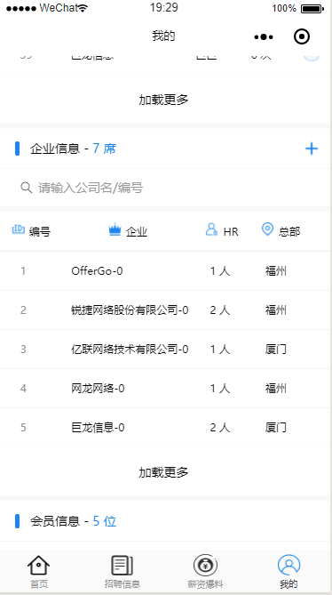   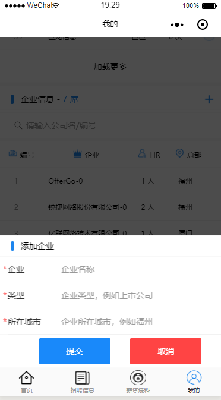
    <br/>
    <span>图5-25 企业信息管理操作图</span>
</p>

##### 1.6.10. HR信息管理
HR信息管理模块包含查看HR信息详情、搜索HR信息、添加HR信息。选中HR查看HR详情，可以查看HR的个人信息及发布的招聘信息，可对HR进行限制登录的操作。添加HR需要输入HR所属公司、HR姓名以及联系电话，皆为必填信息。HR信息管理操作图如图5-26所示。

<p align="center">
    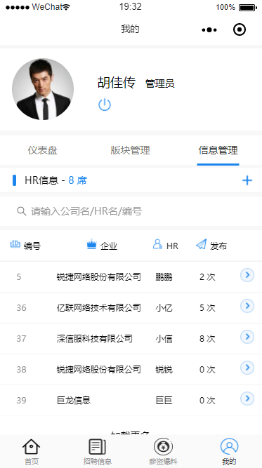   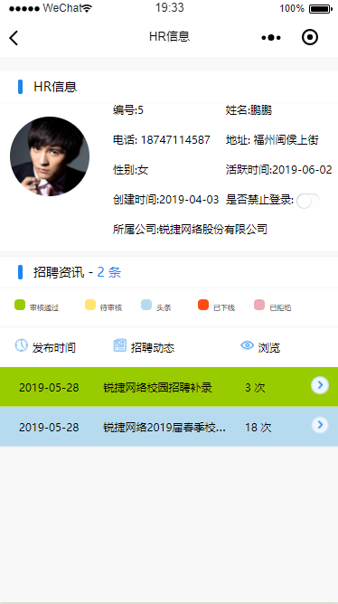    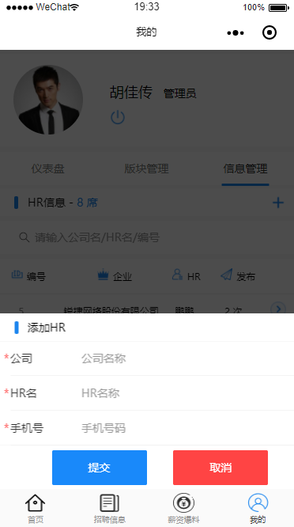
    <br/>
    <span>图5-26 HR信息管理操作图</span>
</p>

##### 1.6.11. 会员信息管理
会员信息管理模块主要包含搜索会员信息、查看会员信息详情功能。点击进入会员详情页可查看会员个人信息、会员收藏信息、会员评论信息、会员爆料信息，还可对会员进行禁止登录操作。信息页面如图5-27所示。

<p align="center">
    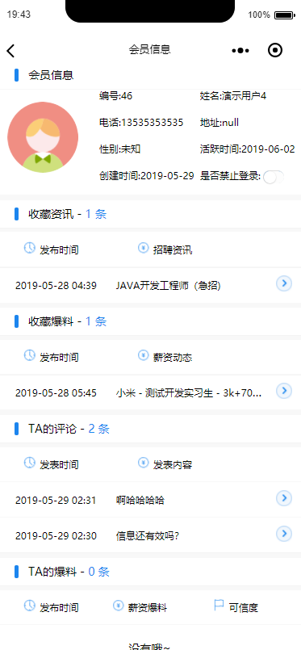
    <br/>
    <span>图5-27 会员信息页</span>
</p>

##### 1.6.12. 管理员信息管理
管理员信息管理模块的功能包含搜索查看管理员信息以及添加管理员信息。添加管理员信息的操作类同添加HR，只是管理员不需要选择所属公司，但系统初始设置所有管理员都属于运营本系统的公司。

#### 1.7. 如何运行

0. 工具
   - node v10
   - webstorm
   - [微信开发者工具](https://developers.weixin.qq.com/miniprogram/dev/devtools/download.html)

1. clone 代码

```html
git clone https://github.com/DavidWhom/recruit.git
```

2. 修改配置

   将**project.config.json**文件中的 appid 修改为自己小程序的appid

3. webstorm打开项目

```html
npm install
npm start
```

4. 微信开发者工具打开项目

#### 1.8. 微信：weinixieshi210

<p align="center">
    
</p>
#### 1.9. 小程序后端

**加微信好友后截图赞赏记录，为您发送后端代码，并提供部署安装技术支持。开源不易，谢谢支持~**

<p align="center">
    
</p>

